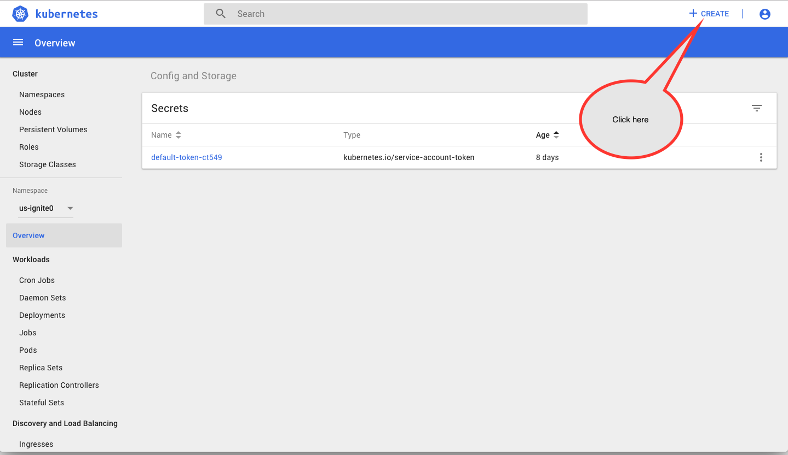
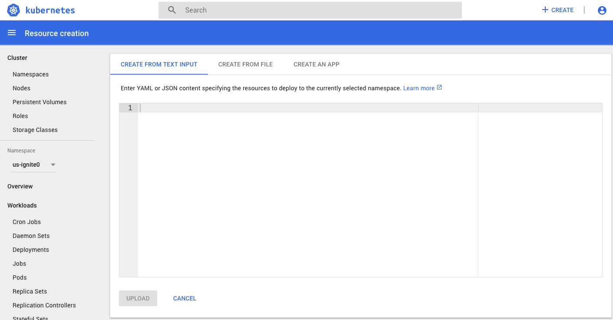
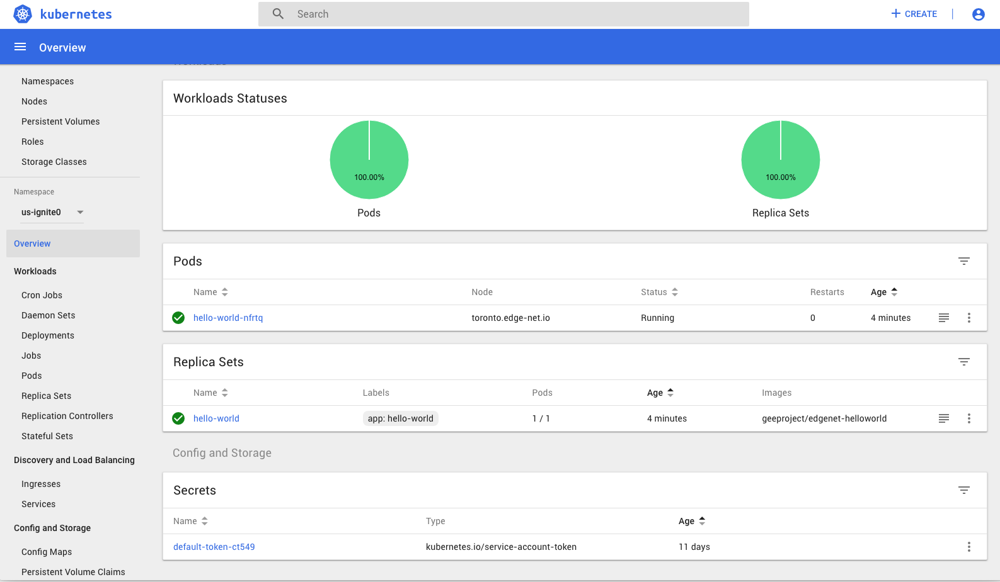
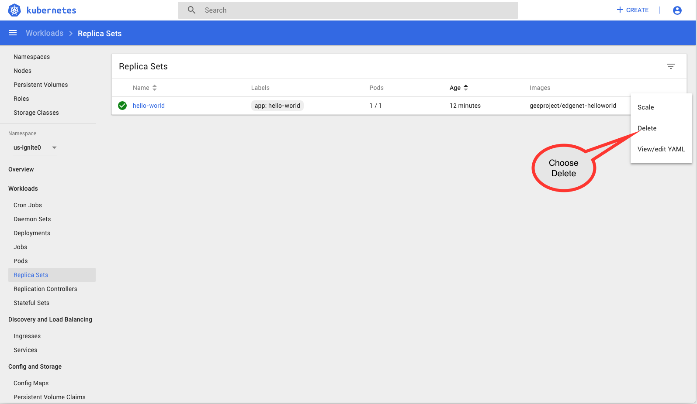
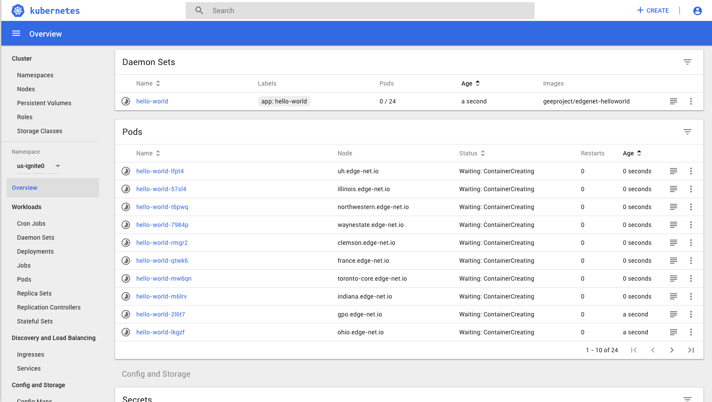

---
---
# Tutorial: Deploying a Client on EdgeNet 
One of the principal sources of value of EdgeNet for its experimenters is that
it provides nodes that are
scattered across the internet, offering both topological and geographic
diversity for experiments in network measurements and distributed systems.
In such experiments, clients are first rate components, which differs from
typical Kubernetes deployments that are centered on servers.
The instructions that guide a client
might not all be known in advance of an experiment, or they might need to be issued in a
coordinated manner across mulitple nodes over the course of an experiment. In either
case, remote piloting could be called for, which differs from the more
"set and forget" approach taken when running a server. This tutorial
thus focuses on how to launch and control a client on EdgeNet.

This tutorial steps you through the creation and deployment of a client on
EdgeNet, which you then control in each of three ways:
* via remote login
* via remote execution
* via a predefined set of instructions

In this tutorial, you will create a Kubernetes pod that consists of a
simple CentOS container. Into your container, you will install a network
measurement tool called `paris-traceroute` tool, which allows you see
the multiple load-balanced
paths taken on a route from your container to a destination address. You
will prepare an image that contains this tool and that you will deploy
across EdgeNet. You will then pilot the tool in each of the ways mentioned
above.

Following this tutorial, you will have the skills necessary to create
a Linux container, install the client software that you like via a package
manager, and save the container as a Docker image for later deployment.
You will be able to deploy that image and control the client in a variety
of ways.

## Technologies That You Will Use
The technologies that you will use are:

1. [Docker](https://www.docker.com/), to create your container
2. [curl](), to download a software package
3. [RPM](https://rpm.org/), to install the software package in the container 
4. [paris-traceroute](), to conduct route traces
5. [Kubernetes](https://kubernetes.io/), to deploy the containers to the EdgeNet nodes

## Prepare
Create accounts:
1. EdgeNet (see [Using EdgeNet](https://edge-net.org/using_EdgeNet.html)),
  making a note of your namespace
2. [Docker Hub](https://hub.docker.com/), a convenient place from which
  to pull Docker images onto your services

Install software:
1. [Docker](https://www.docker.com/) to launch Docker operations from
  the command line.
2. [kubectl](https://kubernetes.io/docs/tasks/tools/install-kubectl/)
  to control a Kubernetes cluster from the command line

Download and test:
1. Download your config file from the portal (see [Using EdgeNet](https://edge-net.org/using_EdgeNet.html)
  and save a copy as `$HOME/.kube/config`. Create the `.kube` directory,
  which is where Kubernetes looks for a configuration file, if you do not
  already have one.
2. Run `$ kubectl get ns` to make sure that you're talking to the right cluster.

## Create Your Container

* Start Docker on your computer.
* Log in to Docker Hub, if starting Docker did not already log you in.
* At the command line, create a CentOS container with `docker create centos`.

The name `centos` identifies the [latest version of the official CentOS build](https://hub.docker.com/_/centos/) in the Docker Hub official repository. You will see output like the following while Docker downloads and prepares the image:

```
$ docker create centos
Unable to find image 'centos:latest' locally
latest: Pulling from library/centos
256b176beaff: Pull complete
Digest: sha256:6f6d986d425aeabdc3a02cb61c02abb2e78e57357e92417d6d58332856024faf
Status: Downloaded newer image for centos:latest
fb01e9909aad5525c2fc3921654e6bb2a030d26ae8b24351f68732ca376920c1
$
```

You should now be able to see the image amongst your Docker images in a listing like the following:

```
$ docker images
REPOSITORY                         TAG                 IMAGE ID            CREATED             SIZE
centos                             latest              5182e96772bf        13 days ago         200MB
perfsonar/testpoint                latest              ca3e8e2af3db        2 months ago        919MB
node                               4.4                 93b396996a16        2 years ago         648MB
$
```

## Run Your Container Locally

* At the command line, run the CentOS image with a Bash shell: `docker run -dit centos`.
* Verify that it is running and obtain its container ID by examining the output of `docker ps`.
* Log into your container with `docker attach <container ID>`, substituting the container ID for `<container ID>`.

Here is an example of a session in which we run the container, log into it, check the system version, and detach using Ctrl-p Ctrl-q (key strokes not visible) so as not to kill the Bash shell:

```
$ docker run -dit centos
8922cd313f377e59cc6030f73a12d4b7a100151c00aff7447073b2d7c6326db5
$ docker ps
CONTAINER ID        IMAGE               COMMAND             CREATED             STATUS              PORTS               NAMES
8922cd313f37        centos              "/bin/bash"         6 seconds ago       Up 5 seconds                            quizzical_yonath
$ docker attach 8922cd313f37
[root@8922cd313f37 /]# cat /etc/system-release
CentOS Linux release 7.5.1804 (Core)
[root@8922cd313f37 /]#
$ docker ps
CONTAINER ID        IMAGE               COMMAND             CREATED              STATUS              PORTS               NAMES
8922cd313f37        centos              "/bin/bash"         About a minute ago   Up About a minute                       quizzical_yonath
$
```

If you are curious about the command line options for `docker run`: 
* `-d` starts the image in "detached mode". If you were to run the container without this option, you would be logged into it directly.
* `-t` and `-i` together allocate a tty as the primary process and keep STDIN open. By default in this case, the tty provides a Bash shell.

With Docker, if a container's primary process ever stops, the container stops as well. If you were to run the CentOS image without a primary process, say via `docker run -d centos`, it would stop right away. Similarly, if you were to detach from the container with an `exit` command instead of Ctrl-p Ctrl-q, the container would stop.

## Install `paris-traceroute`

In what follows, you will want to be careful not to kill your running container, so as not to lose your work.

* If not already logged in to the container, do so now with `docker attach <container ID>`, using the container ID that you see in `docker ps` output.
* From the command line in the container, download the `paris-traceroute` package and the `libparistraceroute` package on which it depends:
   * `curl -Ok https://paris-traceroute.net/downloads/packages/Fedora/20/libparistraceroute-0.9-1.fc20.x86_64.rpm`
   * `curl -Ok https://paris-traceroute.net/downloads/packages/Fedora/20/paris-traceroute-0.9-1.fc20.x86_64.rpm`
* Install these packages:
   * `rpm -iv libparistraceroute-0.9-1.fc20.x86_64.rpm`
   * `rpm -iv paris-traceroute-0.9-1.fc20.x86_64.rpm`
* Clean up:
   * `rm libparistraceroute-0.9-1.fc20.x86_64.rpm`
   * `rm paris-traceroute-0.9-1.fc20.x86_64.rpm`
* Try out the tool with a command like `paris-traceroute -amda www.google.com` 

The command line options for `curl` are:
* `-O` (a capital letter O) to write the output to a file
* `-k` to allow a connection to a website that doesn't have a valid certificate

The command line options for `rpm` are:
* `-i` to install a package
* `-v` for verbose output

The command line option for `paris-traceroute` is:
* `-amda` to invoke the Mutipath Detection Algorithm (MDA)

Your installation of `paris-traceroute` should look something like this:
```
[root@8922cd313f37 /]# curl -Ok https://paris-traceroute.net/downloads/packages/Fedora/20/libparistraceroute-0.9-1.fc20.x86_64.rpm
  % Total    % Received % Xferd  Average Speed   Time    Time     Time  Current
                                 Dload  Upload   Total   Spent    Left  Speed
100  108k  100  108k    0     0  98071      0  0:00:01  0:00:01 --:--:-- 98117
[root@8922cd313f37 /]# rpm -iv libparistraceroute-0.9-1.fc20.x86_64.rpm
Preparing packages...
libparistraceroute-0.9-1.fc20.x86_64
[root@8922cd313f37 /]# rm libparistraceroute-0.9-1.fc20.x86_64.rpm
rm: remove regular file 'libparistraceroute-0.9-1.fc20.x86_64.rpm'? y
[root@8922cd313f37 /]# curl -Ok https://paris-traceroute.net/downloads/packages/Fedora/20/paris-traceroute-0.9-1.fc20.x86_64.rpm
  % Total    % Received % Xferd  Average Speed   Time    Time     Time  Current
                                 Dload  Upload   Total   Spent    Left  Speed
100 10928  100 10928    0     0   7748      0  0:00:01  0:00:01 --:--:--  7750
[root@8922cd313f37 /]# rpm -iv paris-traceroute-0.9-1.fc20.x86_64.rpm
Preparing packages...
paris-traceroute-0.9-1.fc20.x86_64
[root@8922cd313f37 /]# rm paris-traceroute-0.9-1.fc20.x86_64.rpm
rm: remove regular file 'paris-traceroute-0.9-1.fc20.x86_64.rpm'? y
[root@8922cd313f37 /]#
```

And here is a run of `paris-traceroute` (yours will certainly differ):
NOTE : THIS IS LONG, MOVE IT TO THE BOTTOM OF THE TUTORIAL
```
[root@8922cd313f37 /]# paris-traceroute -amda www.google.com
mda to www.google.com (172.217.6.196), 30 hops max, 30 bytes packets
0 None -> 172.17.0.1 [{ 0*1, 0*2, 0*3, 0*4, 0*5, 0*6, 0!7, 0!8 } -> {  1*1, 1*2, 1*3, 1*4, 1*5, 1*6, 1*9, 1*10 }]
1 172.17.0.1 (gateway) -> 192.168.1.1 [{ 1*1, 1*2, 1*3, 1*4, 1*5, 1*6, 1!9, 1*10 } -> {  2*3, 2*1, 2*2, 2*5, 2*4, 2*6, 2*10, 2*11 }]
2 192.168.1.1 -> None [{ 2!3, 2!1, 2!2, 2!5, 2!4, 2!6, 2!10, 2!11 } -> {  3*12, 3*13, 3*14, 3*15, 3*16, 3*17, 3*18, 3*19 }]
3 None -> 24.164.160.40 [{ 3*12, 3*13, 3*14, 3*15, 3*16, 3*17, 3*18, 3*19 } -> {  4*13, 4*12, 4*14, 4*15, 4*17, 4*16, 4*18, 4*19 }]
4 24.164.160.40 (agg63.ulpkny0101h.nyc.rr.com) -> 24.164.165.126 [{ 4*13, 4*12, 4*14, 4*15, 4*17, 4*16, 4*18, 4*19 } -> {  5*16, 5*13, 5*12, 5*14, 5*15, 5*18, 5*17, 5*19 }]
5 24.164.165.126 (agg27.nwbrnycx01r.nyc.rr.com) -> 24.164.164.252 [{ 5*16, 5*13, 5*12, 5*14, 5*15, 5*18, 5*17, 5*19 } -> {  6*12, 6*14, 6*15, 6*18, 6*19, 6*16, 6*13, 6*17 }]
6 24.164.164.252 (agg64.nyclnyrg01r.nyc.rr.com) -> 107.14.19.24 [{ 6*12, 6*14, 6*15, 6*18, 6*19, 6*16, 6*13, 6*17 } -> {  7*15, 7*18, 7*12, 7*14, 7*13, 7*17, 7*19, 7*16 }]
7 107.14.19.24 (bu-ether29.nwrknjmd67w-bcr00.tbone.rr.com) -> 66.109.5.138 [{ 7*15, 7*18, 7*12, 7*14, 7*13, 7*17, 7*19, 7*16, 7*20, 7*21, 7*22, 7*23, 7*24, 7*25, 7*26 } -> {  8*13, 8*17, 8*16, 8*21, 8*23, 8*26, 8?27, 8?28 }]
8 66.109.5.138 -> 66.109.1.35 [{ 8*13, 8*17, 8*16, 8*21, 8*23, 8*26, 8?27, 8?28, 8?41, 8?42, 8?43, 8?44, 8?45, 8?46, 8?47, 8?48, 8?49, 8?50, 8?51, 8?52, 8?53 } -> {  9 14, 9 17, 9 13, 9 15, 9 26, 9 23 }]
8 66.109.6.27 (bu-ether12.nycmny837aw-bcr00.tbone.rr.com) -> 66.109.6.163 [{ 8*18, 8*14, 8*12, 8*19, 8*15, 8*20, 8*24, 8*22, 8*25, 8?29, 8?30, 8?31, 8?32, 8?33, 8?34, 8?35, 8?36, 8?37, 8?38, 8?39, 8?40, 8?54, 8?55, 8?56, 8?57, 8?58, 8?59, 8?60 } -> {  9 20, 9 21, 9 25 }]
8 66.109.6.27 (bu-ether12.nycmny837aw-bcr00.tbone.rr.com) -> 66.109.1.35 [{ 8*18, 8*14, 8*12, 8*19, 8*15, 8*20, 8*24, 8*22, 8*25, 8*31, 8*35, 8*32, 8*29, 8*36, 8*52, 8*49, 8*46, 8*50, 8*41, 8*47, 8*56, 8*59, 8*55, 8*58, 8*53, 8*54, 8*63, 8*64, 8 61, 8 62, 8 69 } -> {  9*14, 9*17, 9*13, 9*15, 9*26, 9*23, 9*28, 9*29, 9 35, 9 52, 9 34, 9 46, 9 43, 9 63, 9 64 }]
8 66.109.5.138 -> 107.14.19.147 [{ 8*13, 8*17, 8*16, 8*21, 8*23, 8*26, 8*28, 8*27, 8*33, 8*30, 8*37, 8*34, 8*39, 8*51, 8*44, 8*42, 8*43, 8*48, 8*40, 8*45, 8*38, 8*57, 8*60, 8*65, 8*68, 8?70, 8*66, 8*67 } -> {  9*24, 9*19, 9*33, 9*30, 9*38, 9*49, 9*47, 9*45, 9 56, 9 67 }]
8 66.109.5.138 -> 66.109.6.157 [{ 8*13, 8*17, 8*16, 8*21, 8*23, 8*26, 8*28, 8*27, 8*33, 8*30, 8*37, 8*34, 8*39, 8*51, 8*44, 8*42, 8*43, 8*48, 8*40, 8*45, 8*38, 8*57, 8*60, 8*65, 8*68, 8*66, 8*67, 8*70 } -> {  9*16, 9*22, 9*12, 9*18, 9*27, 9*36, 9*37, 9*44, 9*51, 9*40, 9*55, 9*59, 9*53, 9*65, 9?77, 9*70 }]
9 66.109.1.35 (0.ae4.pr0.nyc20.tbone.rr.com) -> 66.110.96.13 [{ 9*14, 9*17, 9*13, 9*15, 9*26, 9*23, 9*28, 9*29, 9*35, 9*52, 9*34, 9*46, 9*43, 9*63, 9*64, 9 68, 9 66, 9 71, 9 75 } -> {  10*15, 10*28, 10*33, 10*13, 10*47, 10*48, 10*21, 10*41, 10 50, 10 49, 10 45, 10 16, 10 37, 10 12, 10 64, 10 54, 10 60, 10 46, 10 56, 10 35, 10 43, 10 31, 10 55, 10 57, 10 51, 10 63, 10 42 }]
9 66.109.6.157 (0.ae0.pr0.nyc20.tbone.rr.com) -> 66.110.96.13 [{ 9*16, 9*22, 9*12, 9*18, 9*27, 9*36, 9*37, 9*44, 9*51, 9*40, 9*55, 9*59, 9*53, 9*65, 9*70, 9 77 } -> {  10*15, 10*28, 10*33, 10*13, 10*47, 10*48, 10*21, 10*41, 10 50, 10 49, 10 45, 10 16, 10 37, 10 12, 10 64, 10 54, 10 60, 10 46, 10 56, 10 35, 10 43, 10 31, 10 55, 10 57, 10 51, 10 63, 10 42, 10 53, 10 65, 10 70 }]
9 107.14.19.147 (0.ae2.pr0.nyc20.tbone.rr.com) -> 66.110.96.13 [{ 9*24, 9*19, 9*33, 9*30, 9*38, 9*49, 9*47, 9*45, 9*56, 9*67, 9*73, 9?79, 9?80, 9?81, 9?82 } -> {  10*15, 10*28, 10*33, 10*13, 10*47, 10*48, 10*21, 10*41, 10 50, 10 49, 10 45, 10 16, 10 37, 10 12, 10 64, 10 54, 10 60, 10 46, 10 56, 10 35, 10 43, 10 31, 10 55, 10 57, 10 51, 10 63, 10 42, 10 53, 10 65, 10 70, 10 73 }]
9 66.109.6.163 (0.ae1.pr0.nyc20.tbone.rr.com) -> 66.110.96.53 [{ 9*20, 9*21, 9*25, 9*32, 9*39, 9*50, 9*41, 9*48, 9*54, 9*58, 9*31, 9*42, 9*57, 9*60, 9*72, 9 76, 9 74, 9 78 } -> {  10*14, 10*17, 10*30, 10*39, 10*29, 10*26, 10*23, 10*38, 10 32, 10 25, 10 20, 10 24, 10 19, 10 36, 10 22, 10 44, 10 18, 10 27, 10 34, 10 67, 10 40, 10 52, 10 58, 10 59, 10 72 }]
10 66.110.96.53 (ix-ae-6-0.tcore1.n75-new-york.as6453.net) -> 72.14.195.232 [{ 10*14, 10*17, 10*30, 10*39, 10*29, 10*26, 10*23, 10*38, 10 32, 10 25, 10 20, 10 24, 10 19, 10 36, 10 22, 10 44, 10 18, 10 27, 10 34, 10 67, 10 40, 10 52, 10 58, 10 59, 10 72 } -> {  11*26, 11*14, 11*47, 11*29, 11*30, 11*39, 11*23, 11*38, 11 17, 11 28 }]
10 66.110.96.13 (ix-ae-10-0.tcore1.n75-new-york.as6453.net) -> 72.14.195.232 [{ 10*15, 10*28, 10*33, 10*13, 10*47, 10*48, 10*21, 10*41, 10 50, 10 49, 10 45, 10 16, 10 37, 10 12, 10 64, 10 54, 10 60, 10 46, 10 56, 10 35, 10 43, 10 31, 10 55, 10 57, 10 51, 10 63, 10 42, 10 53, 10 65, 10 70, 10 73 } -> {  11*26, 11*14, 11*47, 11*29, 11*30, 11*39, 11*23, 11*38, 11 17, 11 28, 11 48, 11 33, 11 15, 11 13, 11 41, 11 21 }]
9 107.14.19.147 (0.ae2.pr0.nyc20.tbone.rr.com) -> 66.110.96.13 [{ 9*24, 9*19, 9*33, 9*30, 9*38, 9*49, 9*47, 9*45, 9*56, 9*67, 9*73, 9*80, 9?84, 9?85, 9?86 } -> {  10*15, 10*28, 10*33, 10*13, 10*47, 10*48, 10*21, 10*41, 10 50, 10 49, 10 45, 10 16, 10 37, 10 12, 10 64, 10 54, 10 60, 10 46, 10 56, 10 35, 10 43, 10 31, 10 55, 10 57, 10 51, 10 63, 10 42, 10 53, 10 65, 10 70, 10 73, 10 80 }]
11 72.14.195.232 -> 108.170.248.1 [{ 11*26, 11*14, 11*47, 11*29, 11*30, 11*39, 11*23, 11*38, 11*17, 11*28, 11*48, 11*33, 11*15, 11*13, 11*41, 11 21 } -> {  12*26, 12*30, 12*23, 12*28, 12*13, 12?89, 12?90, 12?91 }]
12 108.170.248.65 -> 108.170.237.207 [{ 12*14, 12*29, 12*47, 12*38, 12*39, 12*15, 12*48, 12*41, 12 17, 12 33, 12 89 } -> {  13*14, 13*29, 13*38, 13*47, 13*48, 13*15, 13*39, 13*41 }]
12 108.170.248.1 -> 108.170.237.205 [{ 12*26, 12*30, 12*23, 12*28, 12*13, 12?91, 12?94, 12*90 } -> {  13 30, 13 26, 13 28, 13 23, 13 13 }]
9 107.14.19.147 (0.ae2.pr0.nyc20.tbone.rr.com) -> 66.110.96.13 [{ 9*24, 9*19, 9*33, 9*30, 9*38, 9*49, 9*47, 9*45, 9*56, 9*67, 9*73, 9*80, 9*84, 9?95, 9?96 } -> {  10*15, 10*28, 10*33, 10*13, 10*47, 10*48, 10*21, 10*41, 10 50, 10 49, 10 45, 10 16, 10 37, 10 12, 10 64, 10 54, 10 60, 10 46, 10 56, 10 35, 10 43, 10 31, 10 55, 10 57, 10 51, 10 63, 10 42, 10 53, 10 65, 10 70, 10 73, 10 80, 10 84 }]
13 108.170.237.207 -> 172.217.6.196 [{ 13*14, 13*29, 13*38, 13*47, 13*48, 13*15, 13*39, 13*41 } -> {  14 14, 14 29, 14 48, 14 38, 14 47, 14 15, 14 39, 14 41 }]
12 108.170.248.1 -> 108.170.237.205 [{ 12*26, 12*30, 12*23, 12*28, 12*13, 12*90, 12*91, 12*94 } -> {  13*30, 13*26, 13*28, 13*23, 13*13, 13*90, 13*91, 13*94 }]
13 108.170.237.205 -> 172.217.6.196 [{ 13*30, 13*26, 13*28, 13*23, 13*13, 13*90, 13*91, 13*94 } -> {  14 14, 14 29, 14 48, 14 38, 14 47, 14 15, 14 39, 14 41, 14 94, 14 30, 14 26, 14 90, 14 28, 14 91, 14 23, 14 13 }]
9 107.14.19.147 (0.ae2.pr0.nyc20.tbone.rr.com) -> 66.110.96.53 [{ 9*24, 9*19, 9*33, 9*30, 9*38, 9*49, 9*47, 9*45, 9*56, 9*67, 9*73, 9*80, 9*84, 9*100, 9?101 } -> {  10*14, 10*17, 10*30, 10*39, 10*29, 10*26, 10*23, 10*38, 10 32, 10 25, 10 20, 10 24, 10 19, 10 36, 10 22, 10 44, 10 18, 10 27, 10 34, 10 67, 10 40, 10 52, 10 58, 10 59, 10 72, 10 100 }]
9 107.14.19.147 (0.ae2.pr0.nyc20.tbone.rr.com) -> 66.110.96.13 [{ 9*24, 9*19, 9*33, 9*30, 9*38, 9*49, 9*47, 9*45, 9*56, 9*67, 9*73, 9*80, 9*84, 9*100, 9*104 } -> {  10*15, 10*28, 10*33, 10*13, 10*47, 10*48, 10*21, 10*41, 10 50, 10 49, 10 45, 10 16, 10 37, 10 12, 10 64, 10 54, 10 60, 10 46, 10 56, 10 35, 10 43, 10 31, 10 55, 10 57, 10 51, 10 63, 10 42, 10 53, 10 65, 10 70, 10 73, 10 80, 10 84, 10 104 }]
Lattice:
None -> [ 172.17.0.1 ]
172.17.0.1 -> [ 192.168.1.1 ]
192.168.1.1 -> [ None ]
None -> [ 24.164.160.40 ]
24.164.160.40 -> [ 24.164.165.126 ]
24.164.165.126 -> [ 24.164.164.252 ]
24.164.164.252 -> [ 107.14.19.24 ]
107.14.19.24 -> [ 66.109.5.138, 66.109.6.27 ]
66.109.5.138 -> [ 66.109.1.35, 66.109.6.163, 66.109.6.157, 107.14.19.147 ]
66.109.1.35 -> [ 66.110.96.53, 66.110.96.13 ]
66.110.96.53 -> [ 72.14.195.232 ]
72.14.195.232 -> [ 108.170.248.65, 108.170.248.1 ]
108.170.248.65 -> [ 108.170.237.207 ]
108.170.237.207 -> [ 172.217.6.196 ]
172.217.6.196
108.170.248.1 -> [ 108.170.237.205 ]
108.170.237.205 -> [ 172.217.6.196 ]
172.217.6.196
66.110.96.13 -> [ 72.14.195.232 ]
72.14.195.232 -> [ 108.170.248.65, 108.170.248.1 ]
108.170.248.65 -> [ 108.170.237.207 ]
108.170.237.207 -> [ 172.217.6.196 ]
172.217.6.196
108.170.248.1 -> [ 108.170.237.205 ]
108.170.237.205 -> [ 172.217.6.196 ]
172.217.6.196
66.109.6.163 -> [ 66.110.96.53, 66.110.96.13 ]
66.110.96.53 -> [ 72.14.195.232 ]
72.14.195.232 -> [ 108.170.248.65, 108.170.248.1 ]
108.170.248.65 -> [ 108.170.237.207 ]
108.170.237.207 -> [ 172.217.6.196 ]
172.217.6.196
108.170.248.1 -> [ 108.170.237.205 ]
108.170.237.205 -> [ 172.217.6.196 ]
172.217.6.196
66.110.96.13 -> [ 72.14.195.232 ]
72.14.195.232 -> [ 108.170.248.65, 108.170.248.1 ]
108.170.248.65 -> [ 108.170.237.207 ]
108.170.237.207 -> [ 172.217.6.196 ]
172.217.6.196
108.170.248.1 -> [ 108.170.237.205 ]
108.170.237.205 -> [ 172.217.6.196 ]
172.217.6.196
66.109.6.157 -> [ 66.110.96.13, 66.110.96.53 ]
66.110.96.13 -> [ 72.14.195.232 ]
72.14.195.232 -> [ 108.170.248.65, 108.170.248.1 ]
108.170.248.65 -> [ 108.170.237.207 ]
108.170.237.207 -> [ 172.217.6.196 ]
172.217.6.196
108.170.248.1 -> [ 108.170.237.205 ]
108.170.237.205 -> [ 172.217.6.196 ]
172.217.6.196
66.110.96.53 -> [ 72.14.195.232 ]
72.14.195.232 -> [ 108.170.248.65, 108.170.248.1 ]
108.170.248.65 -> [ 108.170.237.207 ]
108.170.237.207 -> [ 172.217.6.196 ]
172.217.6.196
108.170.248.1 -> [ 108.170.237.205 ]
108.170.237.205 -> [ 172.217.6.196 ]
172.217.6.196
107.14.19.147 -> [ 66.110.96.53, 66.110.96.13 ]
66.110.96.53 -> [ 72.14.195.232 ]
72.14.195.232 -> [ 108.170.248.65, 108.170.248.1 ]
108.170.248.65 -> [ 108.170.237.207 ]
108.170.237.207 -> [ 172.217.6.196 ]
172.217.6.196
108.170.248.1 -> [ 108.170.237.205 ]
108.170.237.205 -> [ 172.217.6.196 ]
172.217.6.196
66.110.96.13 -> [ 72.14.195.232 ]
72.14.195.232 -> [ 108.170.248.65, 108.170.248.1 ]
108.170.248.65 -> [ 108.170.237.207 ]
108.170.237.207 -> [ 172.217.6.196 ]
172.217.6.196
108.170.248.1 -> [ 108.170.237.205 ]
108.170.237.205 -> [ 172.217.6.196 ]
172.217.6.196
66.109.6.27 -> [ 66.109.1.35, 107.14.19.147, 66.109.6.163, 66.109.6.157 ]
66.109.1.35 -> [ 66.110.96.53, 66.110.96.13 ]
66.110.96.53 -> [ 72.14.195.232 ]
72.14.195.232 -> [ 108.170.248.65, 108.170.248.1 ]
108.170.248.65 -> [ 108.170.237.207 ]
108.170.237.207 -> [ 172.217.6.196 ]
172.217.6.196
108.170.248.1 -> [ 108.170.237.205 ]
108.170.237.205 -> [ 172.217.6.196 ]
172.217.6.196
66.110.96.13 -> [ 72.14.195.232 ]
72.14.195.232 -> [ 108.170.248.65, 108.170.248.1 ]
108.170.248.65 -> [ 108.170.237.207 ]
108.170.237.207 -> [ 172.217.6.196 ]
172.217.6.196
108.170.248.1 -> [ 108.170.237.205 ]
108.170.237.205 -> [ 172.217.6.196 ]
172.217.6.196
107.14.19.147 -> [ 66.110.96.53, 66.110.96.13 ]
66.110.96.53 -> [ 72.14.195.232 ]
72.14.195.232 -> [ 108.170.248.65, 108.170.248.1 ]
108.170.248.65 -> [ 108.170.237.207 ]
108.170.237.207 -> [ 172.217.6.196 ]
172.217.6.196
108.170.248.1 -> [ 108.170.237.205 ]
108.170.237.205 -> [ 172.217.6.196 ]
172.217.6.196
66.110.96.13 -> [ 72.14.195.232 ]
72.14.195.232 -> [ 108.170.248.65, 108.170.248.1 ]
108.170.248.65 -> [ 108.170.237.207 ]
108.170.237.207 -> [ 172.217.6.196 ]
172.217.6.196
108.170.248.1 -> [ 108.170.237.205 ]
108.170.237.205 -> [ 172.217.6.196 ]
172.217.6.196
66.109.6.163 -> [ 66.110.96.53, 66.110.96.13 ]
66.110.96.53 -> [ 72.14.195.232 ]
72.14.195.232 -> [ 108.170.248.65, 108.170.248.1 ]
108.170.248.65 -> [ 108.170.237.207 ]
108.170.237.207 -> [ 172.217.6.196 ]
172.217.6.196
108.170.248.1 -> [ 108.170.237.205 ]
108.170.237.205 -> [ 172.217.6.196 ]
172.217.6.196
66.110.96.13 -> [ 72.14.195.232 ]
72.14.195.232 -> [ 108.170.248.65, 108.170.248.1 ]
108.170.248.65 -> [ 108.170.237.207 ]
108.170.237.207 -> [ 172.217.6.196 ]
172.217.6.196
108.170.248.1 -> [ 108.170.237.205 ]
108.170.237.205 -> [ 172.217.6.196 ]
172.217.6.196
66.109.6.157 -> [ 66.110.96.13, 66.110.96.53 ]
66.110.96.13 -> [ 72.14.195.232 ]
72.14.195.232 -> [ 108.170.248.65, 108.170.248.1 ]
108.170.248.65 -> [ 108.170.237.207 ]
108.170.237.207 -> [ 172.217.6.196 ]
172.217.6.196
108.170.248.1 -> [ 108.170.237.205 ]
108.170.237.205 -> [ 172.217.6.196 ]
172.217.6.196
66.110.96.53 -> [ 72.14.195.232 ]
72.14.195.232 -> [ 108.170.248.65, 108.170.248.1 ]
108.170.248.65 -> [ 108.170.237.207 ]
108.170.237.207 -> [ 172.217.6.196 ]
172.217.6.196
108.170.248.1 -> [ 108.170.237.205 ]
108.170.237.205 -> [ 172.217.6.196 ]
172.217.6.196

[root@8922cd313f37 /]#
```

## Create A New Docker Image

To recapitulate, you have downloaded a vanilla CentOS image from Docker Hub,
run it as a container, and installed paris-traceroute on it. Now, you can save
this as a new image.

* Detach from the container using Ctrl-p Ctrl-q.
* If you need a reminder of the container ID, find it in the output of `docker ps`.
* Create a new image from the present one with `docker commit -m "installed paris-traceroute" <container ID>` 
* Find the ID of the new in the ouput of `docker images`.
* Tag the new image with a name that will be easy to remember with `docker tag <image ID> paris_traceroute`.
* Run the new image with `docker run -dit paris_traceroute`.
* Find the container ID of the new container in the output of `docker ps`.
* Attach to the new container with `docker attach -dit <container ID> `.
* Try out the tool in the new container with a command like `paris-traceroute -amda www.google.com` 

## Automate Such Creation With a Dockerfile

This section is optional. It describes how to automate what you have just done
by using a Dockerfile instead of proceeding manually through each of the steps.

XXX

## Remote Execution

run `paris-traceroute` via `docker exec`

XXX

## Push the New Docker Image

XXX

## Deploy the Image on EdgeNet

XXX

XXX


## Build, Test, and Push the Docker File
The next step is to containerize the *Hello, World* application, test it,
and push it to Docker Hub so it can be loaded.  In the same directory,
write the following markup:

```bash
FROM node:4.4
EXPOSE 8080
COPY server.js .
CMD node server.js
```

_Note_: in the above, change 8080 to whatever random port you picked for your server.  Save this into `dockerfile` (note: no extension) and run:

```bash
$ docker build -t  <username>/edgenet-helloworld .
```

where `<username>` is your Docker Hub user name.

Once the build has been successfully completed, we're ready to test.
On your local host, run:

```bash
$ docker run -p 8080:8080 -d  <username>/edgenet-helloworld
```

As always, substitute the random port number you chose for 8080 in the
above.  Make sure the container is  running with `docker ps`.  You
should see something like:

```bash
CONTAINER ID        IMAGE                           COMMAND                  CREATED             STATUS              PORTS                    NAMES
67b44219b1a4        geeproject/edgenet-helloworld   "/bin/sh -c 'node se…"   27 hours ago        Up 27 hours         0.0.0.0:8080->8080/tcp   pensive_austin
```

If this is all working, repeat the test in your browser and/or with
`curl`.  When you see `Hello, World, from foo!`, kill the container with

```bash
$ docker stop 67b4
```

(substitute the first few digits of your container ID from the
`$ docker ps` command above).

Finally, push your container to Docker Hub.  Run:

```bash
$ docker push <username>/edgenet-helloworld
```

to push to Docker Hub.

## Deploy a Service on EdgeNet
Log in to the [EdgeNet head node](https://headnode.edge-net.org/)
following the directions in [Using EdgeNet](https://edge-net.org/using_EdgeNet.html).
Once you are logged in and have chosen your namespace, you should
see this screen:



Click the Create Button in the top right.  You should see this
screen:



Enter the following YAML code into the text box:

```yaml
apiVersion: extensions/v1beta1
kind: ReplicaSet
metadata:
  name: hello-world
spec:
  template:
    metadata:
      labels:
        app: hello-world
    spec:
      hostNetwork: true           
      containers:
        - name: hello-world
          image: <username>/edgenet-helloworld
          ports:
          - containerPort: <your port>
            hostPort: <your port>
```

Where, as always, `<username>` is your Docker Hub username and `<your port>`
is the random port you've chosen.  Hit `Upload`.

The line `hostNetwork:true` tells Kubernetes to expose the ports from
the Pod.  A `ReplicaSet` is a number of Pods placed in the cluster; in
this case, we have chosen one, and since we didn't specify where this
should be placed it will be placed at a node chosen by Kubernetes.  You
should now see this:

.

Supposing the node is `toronto.edge-net.io` as shown above, you can now
test with any browser by navigating to
`http://toronto.edge-net.io:<port-number>/hello?hostname=Toronto` or
with

```bash
$ curl http://toronto.edge-net.io:<port-number>/hello?hostname=Toronto
```

And get "Hello, World, from Toronto!"

Clicking on the links and menus will give you various views into your
ReplicaSet.  Play around with them and see what you can find out.  When
you're done, choose `Delete` from the right-hand menu in ReplicaSets.



It may take a few minutes to delete.

## A DaemonSet and Using `kubectl`
In this last section we're going to make `hello-world` run on _every_
node in EdgeNet.  And it's just as easy as it was to run on a single
node.

Once again, go to the EdgeNet dashboard and click the `Create` button in
the top right.  This time, when the wizard comes up, enter this YAML
code into the text box:

```yaml
apiVersion: extensions/v1beta1
kind: DaemonSet
metadata:
  name: hello-world
spec:
  template:
    metadata:
      labels:
        app: hello-world
    spec:
      hostNetwork: true           
      containers:
        - name: hello-world
          image: <username>/edgenet-helloworld
          ports:
          - containerPort: <your port>
            hostPort: <your port>
```

Notice that the change from our previous YAML is _one word_: DaemonSet
replaces ReplicaSet.  But this gives a dramatic change in result, as
we'll see.  Click `Upload`.  You will now see this:
.

_24 pods running, one on
every active EdgeNet node!_.  Of course, to test this we don't want to
manually type in every one, so we'll download the names of the nodes
using `kubectl`.

In a terminal window, type

```bash
$ kubectl get pods -o wide
```

You'll get an output like this:

```bash
NAME                READY     STATUS    RESTARTS   AGE       IP                                      NODE
hello-world-2l6t7   1/1       Running   0          4m        192.1.242.153                           gpo.edge-net.io
hello-world-57sl4   1/1       Running   0          4m        72.36.65.80                             illinois.edge-net.io
hello-world-6qn5z   1/1       Running   0          4m        10.103.0.13                             ufl.edge-net.io
hello-world-7984p   1/1       Running   0          4m        10.103.0.2                              waynestate.edge-net.io
hello-world-7dw4r   1/1       Running   0          4m        10.103.0.3                              osf.edge-net.io
hello-world-glxgz   1/1       Running   0          4m        10.103.0.2                              wv.edge-net.io
hello-world-hhsrp   1/1       Running   0          4m        137.110.252.67                          ucsd.edge-net.io
hello-world-kdp9w   1/1       Running   0          4m        199.109.64.50                           nysernet.edge-net.io
hello-world-lfpt4   1/1       Running   0          4m        10.103.0.10                             uh.edge-net.io
hello-world-lkgzf   1/1       Running   0          4m        66.104.96.101                           ohio.edge-net.io
hello-world-m6lrv   1/1       Running   0          4m        149.165.249.129                         indiana.edge-net.io
hello-world-mq5cn   1/1       Running   0          4m        204.102.244.69                          cenic.edge-net.io
hello-world-mw6qn   1/1       Running   0          4m        10.12.9.4                               toronto-core.edge-net.io
hello-world-nbjmn   1/1       Running   0          4m        10.2.9.3                                toronto.edge-net.io
hello-world-nk5qs   1/1       Running   0          4m        104.141.5.26                            louisiana.edge-net.io
hello-world-nrs2p   1/1       Running   0          4m        193.190.127.165                         iminds.edge-net.io
hello-world-prfqj   1/1       Running   0          4m        204.102.228.172                         nps.edge-net.io
hello-world-q2k4w   1/1       Running   0          4m        10.103.0.10                             node-0
hello-world-qgtcp   1/1       Running   0          4m        192.41.233.55                           umich.edge-net.io
hello-world-qtwk6   1/1       Running   0          4m        2001:660:3302:287b:21e:67ff:fe06:a2a8   france.edge-net.io
hello-world-rmgr2   1/1       Running   0          4m        130.127.215.147                         clemson.edge-net.io
hello-world-sbvdz   1/1       Running   0          4m        192.86.139.67                           nyu.edge-net.io
hello-world-t6pwq   1/1       Running   0          4m        165.124.51.203                          northwestern.edge-net.io
hello-world-xfrch   1/1       Running   0          4m        128.171.8.122                           hawaii.edge-net.io
```

`kubectl` is an extremely flexible and powerful tool to query and manage
your deployments and interaction with EdgeNet.  We can simply pipe this
into a file and do some editing, but fortunately `kubectl` will do a lot
of the work for us:

```bash
$ kubectl get pods -o=custom-columns=node:.spec.nodeName
node
illinois.edge-net.io
ufl.edge-net.io
waynestate.edge-net.io
osf.edge-net.io
wv.edge-net.io
ucsd.edge-net.io
nysernet.edge-net.io
uh.edge-net.io
ohio.edge-net.io
indiana.edge-net.io
cenic.edge-net.io
toronto-core.edge-net.io
toronto.edge-net.io
louisiana.edge-net.io
iminds.edge-net.io
nps.edge-net.io
node-0
umich.edge-net.io
france.edge-net.io
clemson.edge-net.io
nyu.edge-net.io
northwestern.edge-net.io
hawaii.edge-net.io
```

Just the node names!  That's what we need.  Now let's put them in a file:

```bash
$ kubectl get pods -o=custom-columns=node:.spec.nodeName  > data.py
```

Edit `data.py` to look like this:

```python
nodes = [
    'illinois.edge-net.io', 'ufl.edge-net.io', 'waynestate.edge-net.io', 'osf.edge-net.io', 'wv.edge-net.io', 'ucsd.edge-net.io', 'nysernet.edge-net.io', 'uh.edge-net.io', 'ohio.edge-net.io', 'indiana.edge-net.io', 'cenic.edge-net.io', 'toronto-core.edge-net.io', 'toronto.edge-net.io', 'louisiana.edge-net.io', 'iminds.edge-net.io', 'nps.edge-net.io', 'node-0', 'umich.edge-net.io', 'france.edge-net.io', 'clemson.edge-net.io', 'nyu.edge-net.io', 'northwestern.edge-net.io', 'hawaii.edge-net.io',
    ]
port = 8080
```

We can then use `data.py` with some reporting code.

```python
#!/usr/bin/python2.7
import urllib2
import sys
from data import nodes, port
import time

def get_response(node_tuple):
  try:
    query = node_tuple[0]
    return (query, node_tuple[1], urllib2.urlopen(query).read().rstrip())
  except urllib2.URLError:
    return (node_tuple[1], 'Error')


pairs = [(node, node.split('.')[0]) for node in nodes]


#
# build the queries
#
queries = [('http://%s:%d/hello?hostname=%s' % (pair[0], port, pair[1]), pair[0]) for pair in pairs]

#
# get the results and split into error and non-error
#

results = [get_response(query) for query in queries]
errors = [result for result in results if result[1] == 'Error']
results = [result for result in results if result[1] != 'Error']

#
# Print the unreachable nodes
#
if (len(errors) > 0): 
  print '| Unreachable |'
  print '|-------------|'
  for e in errors: print '|'  + e[0] + ' |'
if (len(results) > 0):
  # get   the times for each result, and set up records
  # for printing (node, greeting, time)
  final = []
  for r in results:
    start = time.time()
    get_response(r)
    end = time.time()
    final.append((r[1], r[2], (end - start) * 1000))
  #
  # print the results
  #
  
  print '| Node | Greeting | Time in ms |'
  print '|------|:--------:|-----------:|'
 
  for f in final:
    print '%s | %s | %d' % f

```

This will take awhile, and we may find that some nodes aren't as healthy
as we think.  Those are all the errors.  When the code runs, this is
what we see:


| Unreachable |
|-------------|
|toronto-core.edge-net.io |
|toronto.edge-net.io |
|node-0 |
|france.edge-net.io |
|clemson.edge-net.io |


| Node | Greeting | Time in ms |
|------|:--------:|-----------:|
illinois.edge-net.io | Hello, World, from illinois! | 134
ufl.edge-net.io | Hello, World, from ufl! | 156
waynestate.edge-net.io | Hello, World, from waynestate! | 147
osf.edge-net.io | Hello, World, from osf! | 17
wv.edge-net.io | Hello, World, from wv! | 153
ucsd.edge-net.io | Hello, World, from ucsd! | 35
nysernet.edge-net.io | Hello, World, from nysernet! | 160
uh.edge-net.io | Hello, World, from uh! | 127
ohio.edge-net.io | Hello, World, from ohio! | 148
indiana.edge-net.io | Hello, World, from indiana! | 134
cenic.edge-net.io | Hello, World, from cenic! | 29
louisiana.edge-net.io | Hello, World, from louisiana! | 117
iminds.edge-net.io | Hello, World, from iminds! | 491
nps.edge-net.io | Hello, World, from nps! | 34
umich.edge-net.io | Hello, World, from umich! | 189
nyu.edge-net.io | Hello, World, from nyu! | 188
northwestern.edge-net.io | Hello, World, from northwestern! | 147
hawaii.edge-net.io | Hello, World, from hawaii! | 132

## Be Sure to Clean Up!

When you're done, choose `Delete` from the right-hand menu in
ReplicaSets:


## Suggested Future Reading
Here are some starting points for you to further explore the
technologies used in this tutorial, and related technologies:
1. [Using EdgeNet](https://edge-net.org/using_EdgeNet.html)
2. [Docker Tutorial](https://docs.docker.com/get-started/)
3. [Hello, World in Kubernetes](https://kubernetes-v1-4.github.io/docs/hellonode/)
4. [Hello, Minikube](https://kubernetes.io/docs/tutorials/hello-minikube/);
  Minikube allows you to run Kubernetes on your local machine.

