---
---
# Set up an account
To set up an account, you will need to authenticate using a Google account (other options coming soon!), and use that to apply on the [EdgeNet portal](https://sundewcluster.appspot.com/). Once your account is approved, you will be able to download a `kubeconfig` configuration file from the portal. This will enable you to use EdgeNet in exactly the same way as you would use Kubernetes, which is to say, using the `kubectl` command.

Step by step, you will:
1. Navigate to the portal, at https://sundewcluster.appspot.com/
  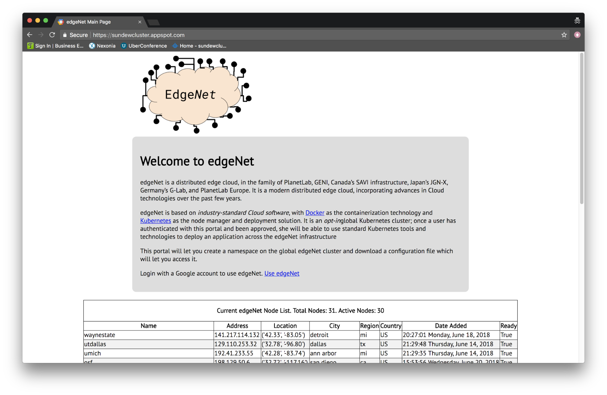
  “Sundew” was an early name for EdgeNet, and that naming persists in some of the URLs and configuration files.
2. Click on [Use edgeNet](https://sundewcluster.appspot.com/next_page/), which will take you to a Google login page. Please sign in with your Google account.
  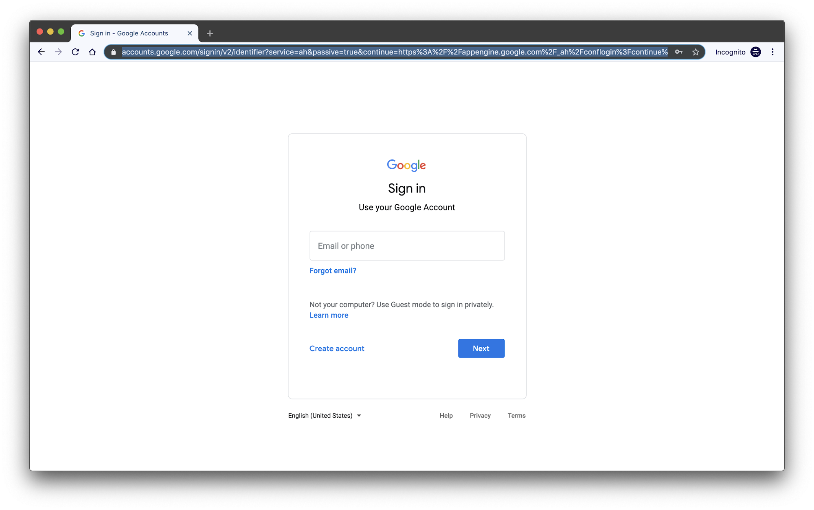
3. Once signed in, you will be asked to read and agree to our AUP on the Edge-net Acceptable Use Policy (scroll down to click on the Accept button).
  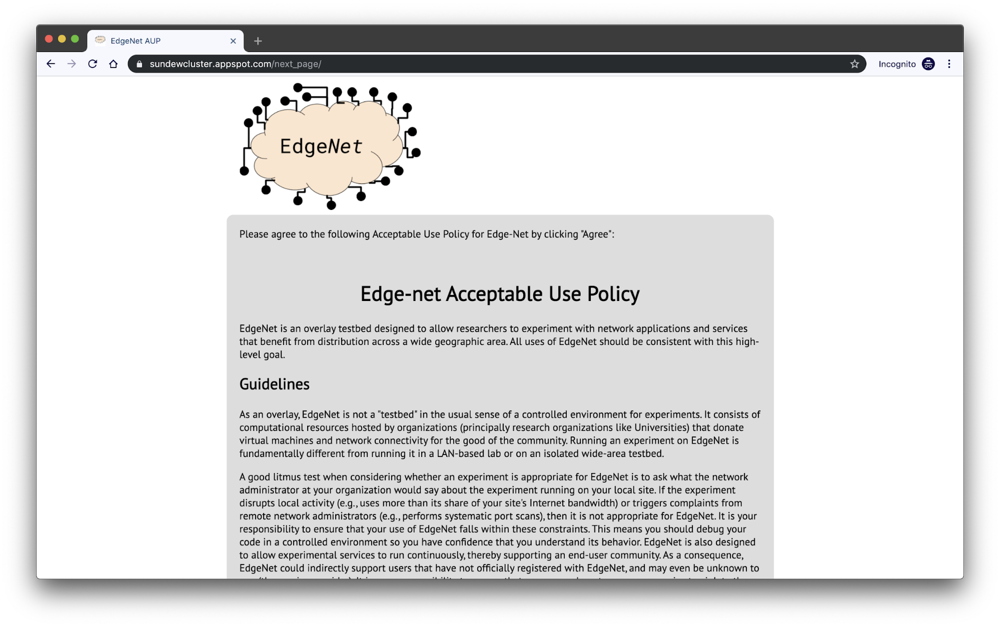
4. At this point you will be notified *“Account for user [your Google account] is pending approval”*. An e-mail will have been sent to the EdgeNet administrators, letting us know that you want to use EdgeNet. If we are not sure who you are, we will contact you first via your Google e-mail address to confirm your identity before approving your account.
5. When we approve your account, you will receive a confirmation email like the one below, inviting you to return to the portal to download your `kubeconfig` configuration file.
  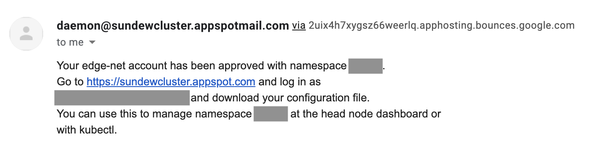
  Note that it also provides you with the string that defines the namespace in which you will work. If you use EdgeNet via `kubectl` at the command line, as in this tutorial, you do not need to worry about your namespace, as it is already recorded in your `kubeconfig` configuration file. However, if you were to use the Kubernetes dashboard GUI at the EdgeNet head node, there are points at which you would have to specify your namespace in order for things to work correctly.
6. Return to the portal at https://sundewcluster.appspot.com/, if you are not still logged in with your Google account, please log in again. You will now see a message like the one below, inviting you to download your `kubeconfig` configuration file, which will be at the link https://sundewcluster.appspot.com/download_config, and will arrive with the name sundew.cfg. Install that file in $HOME/.kube/ on your system, renaming it to “config” if you want it to be the configuration file that Kubernetes uses by default. If you want to use a different name, please be sure to set the KUBECONFIG environment variable accordingly or to use the `--kubeconfig` flag when calling `kubectl`. You are now ready to use `kubectl` to control EdgeNet.
  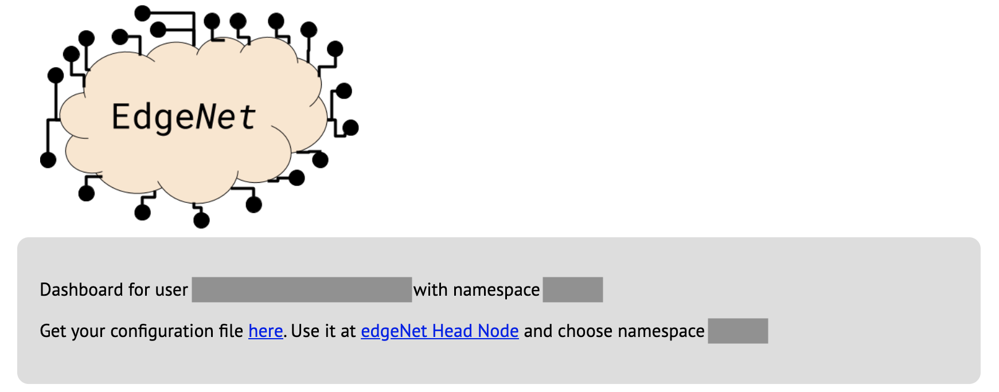
  As the message on the portal states, you can also use the `kubeconfig` file at the EdgeNet head node’s dashboard graphical user interface, being sure to also specify your namespace.
7. To confirm that everything is working, try your first `kubectl` command on EdgeNet. For instance: `$ kubectl get nodes`. This will list all of the currently available EdgeNet nodes around the world (50 nodes in Europe and North American as of 6 September 2019).
  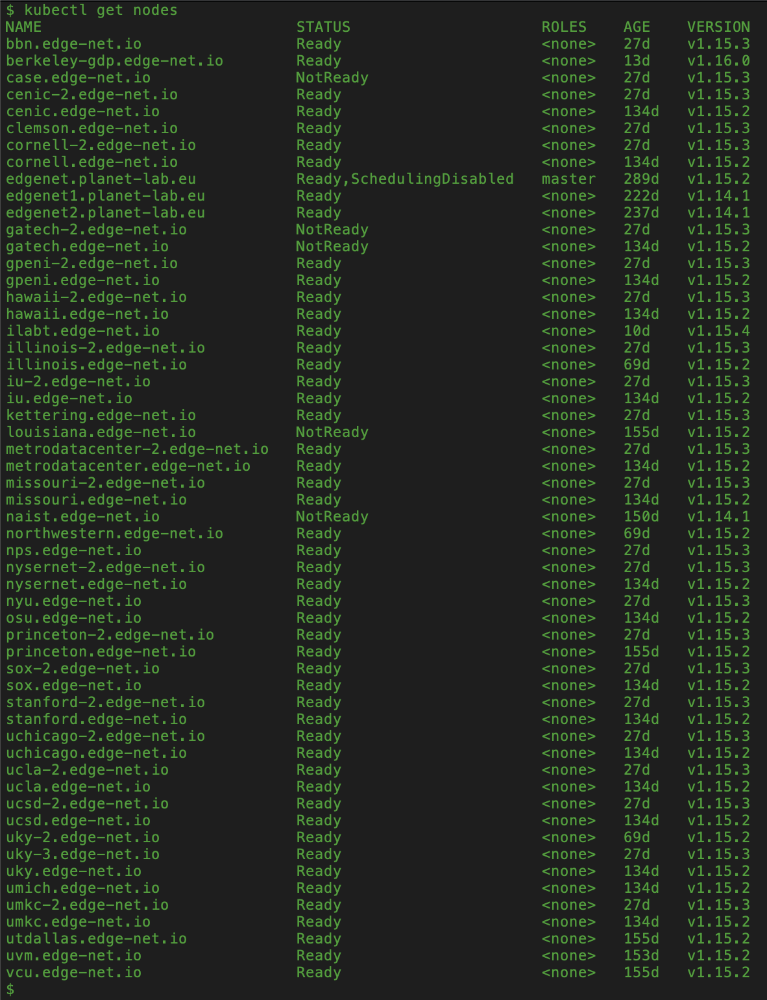

# Create your first distributed deployment
With your `kubeconfig` file, you will now use the Kubernetes `kubectl` command to deploy containers to a selected set of EdgeNet nodes: two in Los Angeles, two in Bloomington, Indiana, and two in Paris. As these nodes are scattered around the world, the effect is very different from deploying to a centralized datacenter. But the Kubernetes command is just a `kubectl apply` command, exactly as you would to create what, in Kubernetes terms, is a DaemonSet controller for containers in a datacenter. The difference is to be found in an EdgeNet extension to Kubernetes: the SelectiveDeployment controller. You will call `kubectl apply` to create a SelectiveDeployment, which will itself control the DaemonSet and restrict it to certain nodes that are selected using geographic criteria.

Step by step, you will:

1. Write a YAML file for the SelectiveDeployment controller, called `my_first_selectivedeployment.yaml`. You can download it from [here](https://edge-net.org/downloads/gefi/my_first_selectivedeployment.yaml) or copy it in from the text below.
    ```yaml
    apiVersion: edgenet.io/v1alpha
    kind: SelectiveDeployment
    metadata:
      name: my-first-selectivedeployment
    spec:
      controller:
        - type: DaemonSet
          name: my-first-daemonset
      type: City
      selector:
        - value: Bloomington
          operator: In
          count: 2
        - value: Los_Angeles
          operator: In
          count: 2
        - value: Paris
          operator: In
          count: 2
    ```  
    Note the “selector” section, which specifies two nodes in each of three cities. Note also the “controller” section, which specifies the name, my-first-daemonset, of the DaemonSet that this SelectiveDeployment controller will control.
2. Use `kubectl apply` to create the SelectiveDeployment controller:
    ```
    $ kubectl apply -f my_first_selectivedeployment.yaml
    ```
3. Confirm that the SelectiveDeployment controller has been successfully created by invoking `kubectl get` with the `selectivedeployments` argument, which can also be abbreviated as `selectivedeployment` or `sd`:
    ```
    $ kubectl get selectivedeployments
    ```
    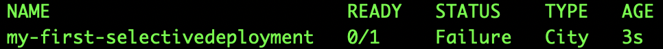
    You will encounter a failure message which is expected as the daemonset doesn't exist yet.
4. Write a YAML file for the DaemonSet controller, called `my_first_daemonset.yaml`. You can download it from [here](https://edge-net.org/downloads/gefi/my_first_daemonset.yaml) or copy it in from the text below.
    ```yaml
    apiVersion: apps/v1
    kind: DaemonSet
    metadata:
      name: my-first-daemonset
      labels:
        app: nginx
    spec:
      selector:
        matchLabels:
          app: nginx
      template:
        metadata:
          labels:
            app: nginx
        spec:
          containers:
          - name: nginx
            image: nginx:1.7.9
            ports:
            - containerPort: 80
    ```
    A DaemonSet typically places a Pod on every node in EdgeNet but in this case the  SelectiveDeployment will configure it. The application will use the Docker image `nginx:1.7.9` (basically, nginx [engine x] is an HTTP and reverse proxy server).
5. Use `kubectl apply` to create the DaemonSet controller:
    ```
    $ kubectl apply -f my_first_daemonset.yaml
    ```
6. Check on the status of this daemonset by invoking `kubectl get` with the `daemonsets` argument:
    ```
    $ kubectl get daemonsets
    ```
    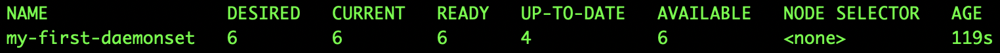
7. Then confirm that the SelectiveDeployment controller has been successfully running by using `kubectl get`:
    ```
    $ kubectl get selectivedeployments
    ```
    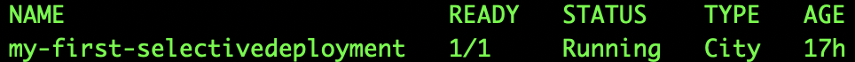
8. Use `kubectl get pods` with `-o wide` argument to list the Pods deployed by the daemonset on the nodes located in `Bloomington, Los Angeles, and Paris`:
    ```
    $ kubectl get pods -o wide
    ```
    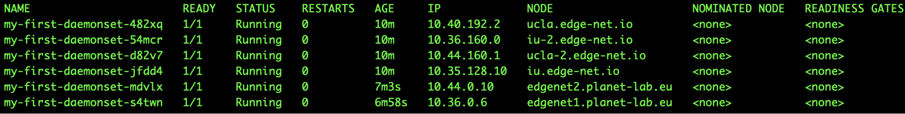
    *Voila!* You have successfully done creating your first distributed deployment!
    If you are interested in to know how this feature works in detail you could find advanced information at [this tutorial](https://docs.google.com/document/d/1o3CbvIxKDGz4xPe-DwQv6bil_3Jlo4NMULkEIive5_8/).

# Tutorials

## First tutorial: Get a Hello World!
In this tutorial, we’re going to show you how to deploy a minimal experiment across EdgeNet and use it. This is a different version of the lighter “Hello, World”, tutorial including Selective Deployment.

Step by step, you will:

1. Write a YAML file which includes the SelectiveDeployment and the DaemonSet controller, called `helloWorld.yaml`. You can download it from [here](https://edge-net.org/downloads/gefi/helloWorld.yaml) or copy it in from the text below, then will need to change `<username>` in the last line to a nickname for yourself; please pick a good one.  
    ```yaml
    # SelectiveDeployment to take Hello World DaemonSet under control
    apiVersion: edgenet.io/v1alpha
    kind: SelectiveDeployment
    metadata:
      name: hello-world-new
    spec:
      controller:
        - type: DaemonSet
          name: hello-world-new
      type: Polygon
      selector:
        - value: "[ [ 2.2150567, 48.8947616 ], [ 2.2040704, 48.8084639 ], [ 2.3393396, 48.7835862 ], [ 2.4519494, 48.8416903 ], [ 2.3932412, 48.9171024 ] ]"
          operator: In
          count: 0
        - value: "[ [ -129.4628906, 49.325122 ], [ -116.1914063, 51.2344074 ], [ -97.3828125, 26.1159859 ], [ -109.5996094, 21.4530686 ] ]"
          operator: In
          count: 0
    ---
    # DaemonSet of Hello World exercise
    apiVersion: extensions/v1beta1
    kind: DaemonSet
    metadata:
      name: hello-world-new
    spec:
      template:
        metadata:
          labels:
            app: hello-world-new
        spec:
          hostNetwork: true
          containers:
            - name: hello-world-new
              image: tutum/curl
              command: ["/bin/sh"]
              args: ["-c", "while true; do curl http://princeton.edge-net.io:5000/hello/$(hostname)/<username>; sleep 7200; done"]
    ```
    The line `hostNetwork:true` tells Kubernetes to expose the ports from the Pod. A DaemonSet places a Pod on every node in EdgeNet. The name of your application is `hello-world-new`, and it will use the Docker `image tutum/curl` (an Ubuntu OS with `curl` installed). The polygons defined for SelectiveDeployment cover `the city of Paris, the states of Washington and California`. It will then execute the command
    ```
    /bin/sh -c "while true; do curl http://princeton.edge-net.io:5000/hello/$(hostname)/<nickname>; sleep 72000; done";
    ```
    in other words, send a Hello to the server, sleep for a couple of hours, then send another (we assume you'll take down the slice after a single Hello from each node).
2. Use `kubectl apply` to create the SelectiveDeployment and Daemonset controllers:
    ```
    $ kubectl apply -f helloWorld.yaml
    ```
3. Check on the status of this daemonset by invoking `kubectl get` with the `daemonsets` argument:
    ```
    $ kubectl get daemonsets
    ```
    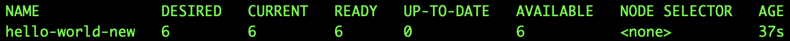
4. Then confirm that the SelectiveDeployment controller has been successfully running by using `kubectl get`:
    ```
    $ kubectl get selectivedeployments
    ```
    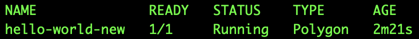
5. Use `kubectl get pods` with `-o wide` argument to list the Pods deployed by the daemonset on the nodes located in `Paris, the states of California and Washington`:
    ```
    $ kubectl get pods -o wide
    ```
    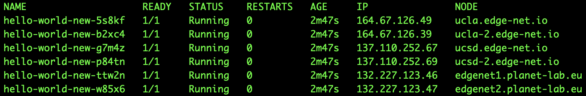
    Here is your pods have deployed to talk to server directly by saying hello from Paris, California, and Washington!
    For a full set of kubectl commands and options, see [Kubectl cheat sheet](https://kubernetes.io/docs/reference/kubectl/cheatsheet/#kubectl-context-and-configuration).
6. Check out your hellos, for a simple text presentation, talk to the server directly [here](http://princeton.edge-net.io:5000/show_hellos).  
  You can find a nicer graphical presentation on a [mapping page we've prepared](https://editor.engagelively.com/widgets/rick/merif-demo-hello-world/index.html).  
  For further information [click here](http://edge-net.org/simple_hello_world.html).

## Second tutorial: Paris Traceroute Exercise
In this tutorial, we're going to deploy a world-class network mapping system on EdgeNet, [Paris Traceroute](https://paris-traceroute.net/).
Paris Traceroute is designed to overcome the traditional limitations in [traceroute](https://en.wikipedia.org/wiki/Traceroute).  Specifically, classic traceoute fails when routers load-balance across multiple paths, a common Internet feature.  Paris Traceroute is a staple of modern network mapping, used by [M-Lab](https://www.measurementlab.net/) extensively.

[Multi-level MDA-Lite Paris Traceroute](https://labs.ripe.net/Members/kevin_vermeulen/multilevel-mda-lite-paris-traceroute) is a form of traceroute with a Multi-path Detection Algorithm (MDA), which attempts to avoid as many redundant traceroute packets as possible. The inventors' aim is to reduce the packets necessary while also being confident they have mapped all of the path diversity.

Step by step, you will:
1. Write a YAML file which includes the SelectiveDeployment and the DaemonSet controller, called `paris_traceroute.yaml`. You can download it from [here](https://edge-net.org/downloads/gefi/paris_traceroute.yaml) or copy it in from the text below.
    ```yaml
    # DaemonSet of Paris Traceroute exercise
    apiVersion: extensions/v1beta1
    kind: DaemonSet
    metadata:
      name: paristraceroute
    spec:
      template:
        metadata:
          labels:
            app: multilevel-mda-lite-paristraceroute
        spec:
          hostNetwork: true
          containers:
            - name: multilevel-mda-lite-paristraceroute
              image: bljuma/multilevel-mda-lite-paristraceroute
              command: [ "/bin/bash", "-c", "--" ]
              args: [ "while true; do sleep 30; done;" ]
    ---
    # SelectiveDeployment to take Paris Traceroute DaemonSet under control
    apiVersion: edgenet.io/v1alpha
    kind: SelectiveDeployment
    metadata:
      name: paristraceroute
    spec:
      controller:
        - type: DaemonSet
          name: paristraceroute
      type: State
      selector:
        - value: TX
          operator: In
          count: 0
        - value: IL
          operator: In
          count: 0
        - value: CA
          operator: In
          count: 2
    ```
    The line `hostNetwork:true` tells Kubernetes to expose the ports from the Pod. A DaemonSet places a Pod on every node in EdgeNet. The name of your application is `paristraceroute`, and it will use the Docker image `bljuma/multilevel-mda-lite-paristraceroute`. The states defined for SelectiveDeployment pick up all nodes located in Texas and Illinois, and two nodes located in California. It will then loop continuously, doing nothing. That's where the `kubectl exec` comes in.
2. Use `kubectl apply` to create the SelectiveDeployment and Daemonset controllers:
    ```
    $ kubectl apply -f paris_traceroute.yaml
    ```
3. Check on the status of this daemonset by invoking `kubectl get` with the `daemonsets` argument:
    ```
    $ kubectl get daemonsets
    ```
    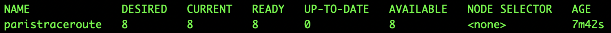
4. Then confirm that the SelectiveDeployment controller has been successfully running by using `kubectl get`:
    ```
    $ kubectl get selectivedeployments
    ```
    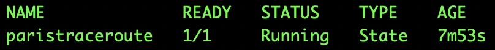
5. Use `kubectl get pods` with `-o wide` argument to list the Pods deployed by the daemonset on the nodes located in `Texas, Illinois, and California`:
    ```
    $ kubectl get pods -o wide
    ```
    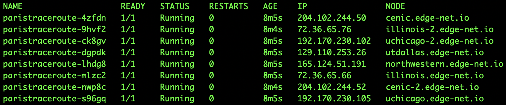
    Here is your pods have deployed to talk to server directly by saying hello from Paris, California, and Washington!
    For a full set of kubectl commands and options, see [Kubectl cheat sheet](https://kubernetes.io/docs/reference/kubectl/cheatsheet/#kubectl-context-and-configuration).
6. Make a Paris Traceroute do something

  - *Via kubectl remote execution*

    All the deployment has essentially done is set up measurement servers; to run an actual measurement, you must query the server. Typically, this would be done by setting up a web server as a front end, which uses ports very quickly. Fortunately, Kubernetes and Docker permit get bash shell on a running container over the existing kubectl port, through `kubectl exec`. kubectl exec takes two arguments: the name of the pod to execute the command, and the command itself. The name of the pod will typically be `<deployment-name>-<hash>`.

    The shell script to query Paris Traceroute is at paris_traceroute.sh. This is a convenience wrapper around a command line; if you don't want to use it, the command `kubectl exec` will work:
    ```
    $ kubectl exec <container-name> -- bash -c "python3 multilevel-mda-lite/MDALite.py <ip address>"
    ```
    If you use `paris_traceroute.sh`, the command is:
    ```
    $ ./paris_traceroute.sh <short-container-name> <ip-address>
    ```
    Let’s look at these in real life scenario; in our case the name of DaemonSet is paristraceroute, and the hash is s96gq, thereby the pod name is paristraceroute-s96gq. So typical command would be:
    ```
    $ kubectl exec paristraceroute-s96gq -- bash -c "python3 multilevel-mda-lite/MDALite.py 8.8.8.8"
    ```
    `paris_traceoute.sh` simplifies this to `./paris_traceroute.sh <hash> <ip-address>`, e.g.
    ```
    $ ./paris_traceroute.sh s96gq 8.8.8.8
    ```
    In both ways, the results will come out in text on your local machine.

  - *Via remote login*

    If you want to run your commands inside an existing container like you do via SSH the command which allows you to do that would be:
    ```
    $ kubectl exec -it paristraceroute-s96gq bash
    ```
    since the name of the pod will typically be `<deployment-name>-<hash>`; in our case, it is `paristraceroute-s96gq`. Then you need to execute the command
    ```
    $ python3 multilevel-mda-lite/MDALite.py 8.8.8.8
    ```
    The results will be popped up on your screen.

    For further information [click here](http://edge-net.org/paris_traceroute.html).
