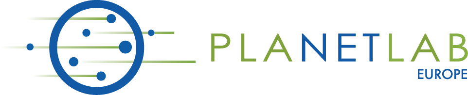
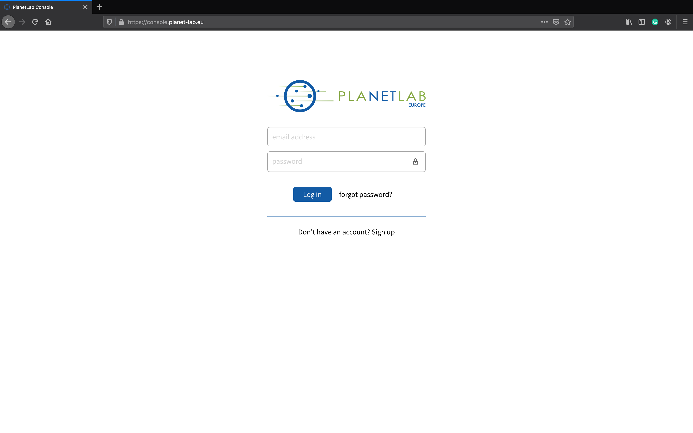
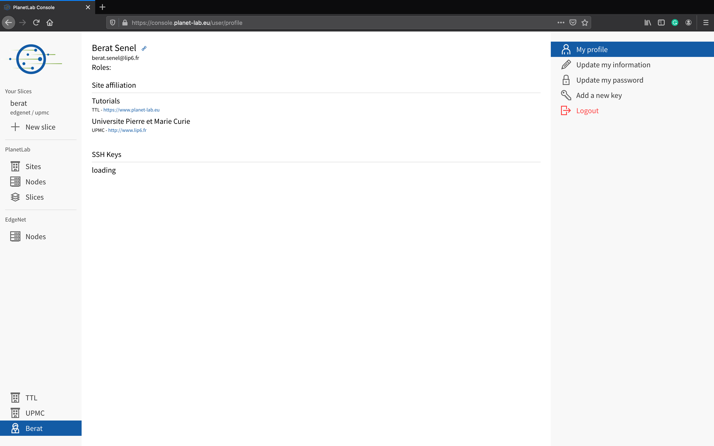
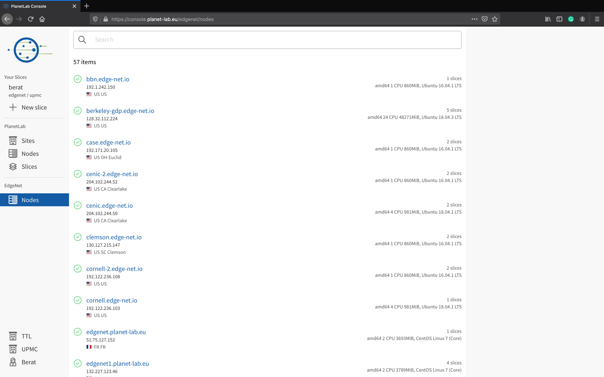
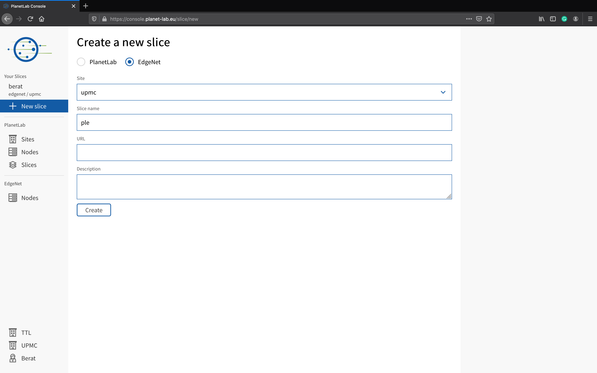
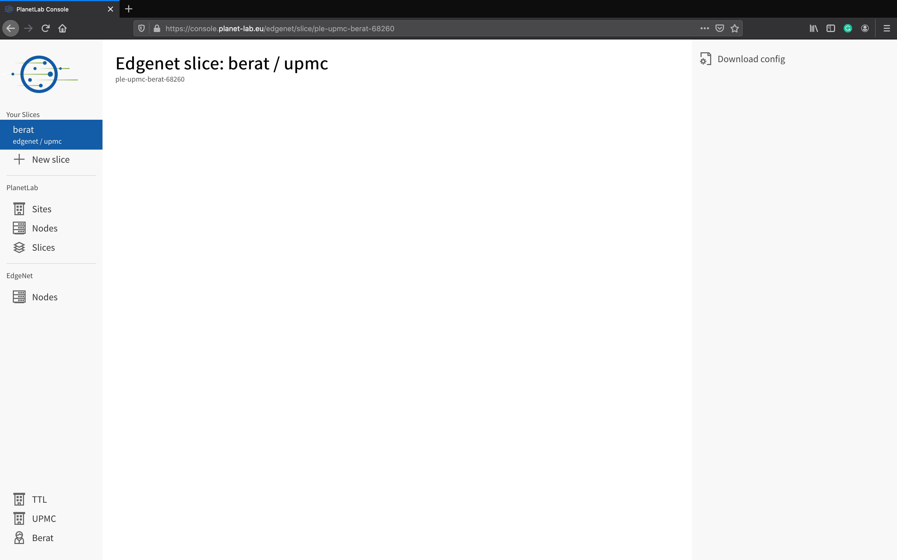

---
---
# Set up an account by PlanetLab Europe

To set up an account, you will need to authenticate by using your PlanetLab Europe credentials. Once you signed in, you will be able to create a slice (namespace) on EdgeNet, which generates a `kubeconfig` configuration file that you can download from the console. This will enable you to use EdgeNet in exactly the same way as you would use Kubernetes, which is to say, using the `kubectl` command.

Step by step, you will:
1. Navigate to the console, at [https://console.planet-lab.eu/](https://console.planet-lab.eu/)
  
  Fill the fields of email and password according to your PlanetLab Europe credentials.
2. Once signed in, you are on the home page of the PlanetLab Europe console.
You can notice that there is a division called EdgeNet including Nodes, so, click on [EdgeNet Nodes](https://console.planet-lab.eu/edgenet/nodes) that button will take you to the page showing the list of the EdgeNet nodes.
  
3. At this point, you will notice the list containing the information of name, IP address, location, hardware, and slice count. Additionally, you can get the slice details for a node by clicking on its name.
  
4. To begin using EdgeNet you need to create a slice (namespace) which generates a `kubeconfig` configuration file. In the first place, click on the "New Slice" button to go to the form that you need to fill out. Secondly, you will select the EdgeNet option. Hereinafter, you need to select a site that you participate in from the site option list, and to name the Slice that you desire to create freely. After you get all done, now you can click on the "Create" button.
  
  Note that a `kubeconfig` file provides you with the string that defines the namespace in which you will work. If you use EdgeNet via `kubectl` at the command line, as in this tutorial, you do not need to worry about your namespace, as it is already recorded in your `kubeconfig` configuration file. However, if you were to use the Kubernetes dashboard GUI at the EdgeNet head node, there are points at which you would have to specify your namespace in order for things to work correctly.
5. In the end, click on the slice you created that is listed below the list called "Your Slices". You will see the "Download config" button on the page that you reach after. Let's download your `kubeconfig` configuration file by clicking on that button. Install that file in $HOME/.kube/ on your system, renaming it to “config” if you want it to be the configuration file that Kubernetes uses by default. If you want to use a different name, please be sure to set the KUBECONFIG environment variable accordingly or to use the `--kubeconfig` flag when calling `kubectl`. You are now ready to use `kubectl` to control EdgeNet.
  
  You can also use the `kubeconfig` file at the [EdgeNet head node’s dashboard](https://headnode.edge-net.org/#!/login) graphical user interface, being sure to also specify your namespace.
6. To confirm that everything is working, try your first `kubectl` command on EdgeNet. For instance: `$ kubectl get nodes`. This will list all of the currently available EdgeNet nodes around the world (50 nodes in Europe and North American as of 6 September 2019).
  
